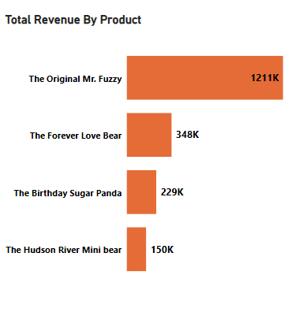
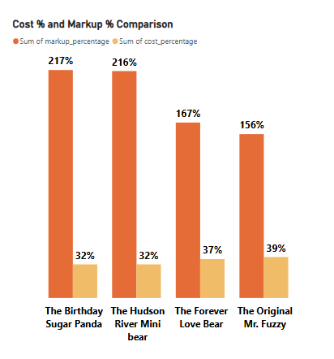
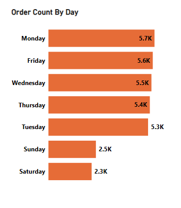
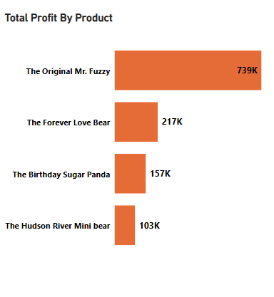

# 📊 Retail Product & Profitability Analysis (SQL)

## 📌 Project Overview
This project presents a structured SQL-based exploratory data analysis of a retail e-commerce dataset (~32K+ orders) to evaluate revenue, profit, markup percentage, 
and weekday demand patterns. The analysis focuses on identifying pricing inefficiencies and profitability gaps using multi-table joins and KPI calculations.

---

## 🗂 Dataset Description

**Tables Used:**
- `Orders`
- `Order_Items`
- `Products`

**Dataset Characteristics:**
- ~32,000+ orders
- Multiple products with different cost and selling prices
- Relational schema enabling revenue and profitability analysis

---

## 🎯 Business Objective

The goal of this project was to:

- Evaluate product-level revenue and profitability  
- Compute and compare markup % across products  
- Identify pricing inefficiencies  
- Analyze weekday order distribution patterns  
- Provide structured insights for margin optimization  

---

## 🛠 Tools & Techniques

- SQL
  - Multi-table Joins
  - CTEs (Common Table Expressions)
  - Aggregations
  - Group By & Filtering
  - Revenue, Cost & Profit Calculations
  - Markup % Computation
  - Power BI (DirectQuery) for visualization support

---

## 🔎 Key Analysis Performed

### 1️⃣ Revenue & Profit Analysis

- Joined Orders, Order_Items, and Products tables
- Calculated total revenue and total profit per product
- Compared product performance based on sales and profitability

---

### 2️⃣ Markup Percentage Analysis

**Formula Used:**

```sql
(Total Sales - Total Cost) / Total Cost * 100
```

**Findings:**

- Highest-selling product had the lowest markup (156%)
- Lower-selling products carried higher margins (216–217%)
- Revenue ranking was inversely related to margin ranking
- Clear pricing optimization opportunity identified

---

### 3️⃣ Weekday Demand Analysis

- Grouped orders by weekday
- Observed stronger demand on weekdays (Mon–Fri)
- Weekend order volume significantly lower
- Insight useful for staffing and operational planning

---

## 📈 Key Business Insights

- Revenue concentration varied significantly across products
- Profitability did not directly align with sales volume
- High-revenue product operated at lower margin efficiency
- Markup inconsistencies suggest pricing adjustment opportunities
- Demand patterns are weekday-driven

---

## 📊 Visual Outputs

### Revenue by Product


### Markup Comparison


### Weekday Order Distribution


### Profit Summary


---

## 📂 Repository Structure

```
Retail-Product-Profitability-Analysis-SQL
│
├── sql/
│   └── product_profitability_analysis.sql
├── presentation/
│   └── Product_Profitability_Analysis.pdf
├── screenshots/
│   ├── revenue_by_product.png
│   ├── markup_comparison.png
│   ├── weekday_orders.png
│   └── profit_summary.png
└── README.md
```

---

## 🚀 Outcome

This project demonstrates:

- Strong SQL-based exploratory data analysis capability  
- Ability to work with relational datasets  
- Business-focused KPI and profitability analysis  
- Structured insight generation for pricing strategy  

---

## 👤 Author

**Enos Mohod**  
Aspiring Data Analyst | SQL | Power BI | Python  
Turning data into actionable business insights
